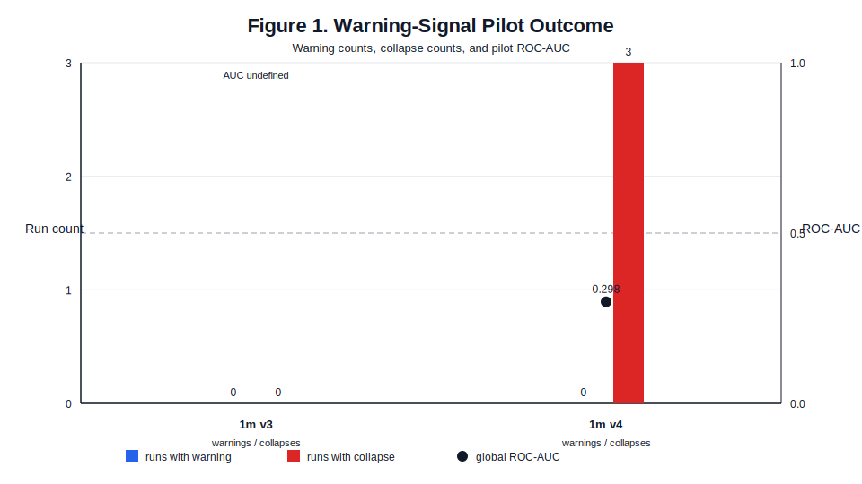
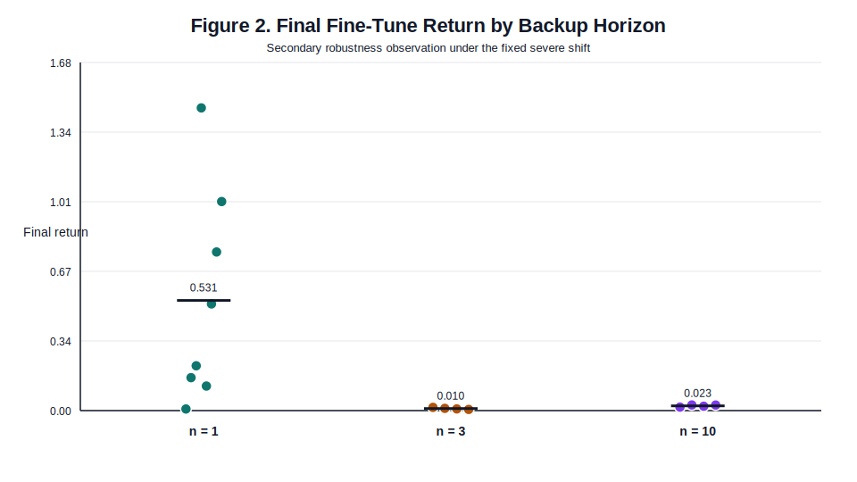

# When TD-Variance Early Warning Fails: A Post-Mortem on Off-Policy Fine-Tuning Under Dynamics Shift

## Abstract

This experiment began as an early-warning study. The original question was can a recent-buffer temporal-difference (TD) variance score warn before fine-tuning failure under a controlled dynamics shift in robotic locomotion? We implemented that warning design in a narrow vertical slice: Go1 flat-terrain joystick locomotion trained with Soft Actor-Critic in Brax with MuJoCo Playground integration. The answer, in the regime we actually ran, is no.

The warning-focused pilots were both run on a representative cell (`n = 1`, critic width `256`) under a severe fixed shift. In `pilot_gate_1m_v3`, the selected shift produced an informative degradation band and acceptable projected compute budget, but the diagnostic produced neither warnings nor collapses across `3` reported runs. In `pilot_gate_1m_v4`, tightening the collapse threshold produced threshold-defined collapses in all `3` reported runs, but still no warnings, no positive lead time, and global ROC-AUC of only `0.298`. This is not just a null result. It is a structural failure mode in the current score/trigger design under the trace length and prediction horizon actually used.

We argue that the failure is mechanistically explained by the interaction between score geometry and run geometry: the score is normalized to the first two shifted-domain warmup evaluations, those evaluations emit no warning rows, the prediction horizon is long relative to the short pilot traces, and tightening the collapse threshold changes labels more than it changes underlying training dynamics. As a secondary observation, a later horizon-matched robustness sweep under the same severe shift found that `n = 1` retained partial performance on average, whereas `n = 3` and `n = 10` finished near zero. That result is real but confounded and therefore not the paper's main claim.

The contribution is therefore a post-mortem, not a positive method paper: a concrete example of how a plausible TD-variance early-warning design can fail in off-policy fine-tuning under shift, plus specific design lessons for what a more credible warning study would need next.

## 1. Introduction

Fine-tuning is attractive in robotic reinforcement learning because pretraining is expensive and shift is unavoidable. The practical question is not just whether a policy can adapt, but whether failure during adaptation can be detected early enough to matter operationally.

This repository was originally built around that question. The intended study paired fine-tuning under explicit dynamics shift with a recent-buffer TD-based warning score meant to trigger before threshold-defined collapse. The resulting experiments did not validate the warning mechanism. Rather than bury that result behind a weaker positive story, this paper centers it.

That framing matters. A narrow but well-diagnosed failure is more useful than a thin positive claim. In this case the important result is not that TD error is relevant to RL instability in general; that is already known. The important result is that a specific and operationally plausible recent-buffer TD-variance design can fail structurally in a realistic off-policy fine-tuning slice, even after substantial pilot calibration.

## 2. Related Work

The transfer and adaptation literature is already crowded. Domain-randomization and sim-to-real papers such as Tobin et al. (2017) and Peng et al. (2018) emphasize robustness through pretraining rather than instability during later fine-tuning. Online adaptation papers such as Hansen et al. (2021) and Kumar et al. (2021) focus on recovering performance under changing conditions, not on diagnosing when ordinary off-policy fine-tuning is about to fail.

The more relevant neighborhood is off-dynamics reinforcement learning and off-policy instability. Off-dynamics work such as Eysenbach et al. (2021) studies adaptation across mismatched source and target dynamics, while the off-policy-instability literature explains why replay-based actor-critic methods can become brittle. Fedus et al. (2020) are especially relevant here because they show that uncorrected `n`-step returns can materially affect replay-based RL. That makes the backup-horizon factor scientifically motivated, but it is not the primary novelty claim of this paper.

The closest conceptual overlap with the original warning idea is Li et al. (2023), which treats TD error as a useful training-time diagnostic. The distinct question here is narrower and more operational: can a recent-buffer-only TD-based score, evaluated online during fine-tuning under explicit shift, provide usable warning before threshold-defined collapse? In the regime we actually ran, the answer is no.

## 3. Experimental Setup

### 3.1 Environment and Learner

All experiments use `Go1JoystickFlatTerrain` with Soft Actor-Critic (Haarnoja et al., 2018) in Brax (Freeman et al., 2021) with MuJoCo Playground integration (Zakka et al., 2025). The actor width is fixed at `256 x 3`, batch size is `256`, evaluation interval is `100,000` environment steps, and each fine-tune run is allocated `1,000,000` environment steps. This is intentionally a narrow vertical slice rather than a general RL benchmark suite.

### 3.2 Shift Geometry

Nominal pretraining used the repository's default train-domain randomization:

- friction range `(0.8, 1.2)`
- payload range `(0.8, 1.2)`

The warning-focused pilots and the later robustness comparison both used the same severe fine-tune shift selected through pilot calibration:

- fine-tune friction `0.10`
- fine-tune payload `2.2`

This operating point first became viable in `pilot_gate_1m_v3`, where it produced an informative representative-cell drop band while staying within the compute budget (`95.98` conservative GPU-hours under the originally planned `3 x 2 x 8` factorial accounting).

### 3.3 Collapse Threshold and Warning Score

The repository defines collapse from a frozen shifted-domain baseline:

- `mu0`: shifted-domain baseline return mean before fine-tuning
- `sigma0`: shifted-domain baseline return standard deviation
- threshold: `min(mu0 - c * sigma0, mu0 - rho * |mu0|)`

The warning score is:

- `score = log(var_t) - log(var_warmup)`

with trigger:

- `score > log(3)` for `2` consecutive evaluations

Here `var_t` is the population variance of one-step TD residuals computed over a snapshot from the recent-transition buffer, whose default capacity is `100,000` transitions. `var_warmup` is the average of the first two recorded TD-variance measurements after entering the shifted fine-tune regime. Those two warmup checkpoints do not emit warning rows. The score is therefore normalized to early shifted-domain behavior, not nominal-domain behavior.

When ROC-AUC is reported, the predictand is not “warning fired.” It is a future-collapse label defined on emitted evaluation rows: the label is `1` if threshold-defined collapse occurs in any of the next `10` evaluations and `0` otherwise. That `10`-evaluation horizon is the same horizon later discussed in the post-mortem diagnosis.

### 3.4 What Was Actually Run

The warning-focused pilots were both run only on the representative cell:

- `n = 1`
- critic width `256`

The warning diagnostic was never run on the `n = 3` or `n = 10` configurations; those horizons appear only in the later follow-on described in Section 6. Both `pilot_gate_1m_v3` and `pilot_gate_1m_v4` contributed `3` reported runs.

The later robustness comparison was a secondary study, run after the warning story failed. It used:

- `n = 1`: `8` seeds
- `n = 3`: `4` seeds
- `n = 10`: `4` seeds
- critic width fixed at `256`

Each horizon used its own compatible pretrained checkpoint. That later result is therefore about horizon-indexed end-to-end configurations, not about swapping only fine-tune horizon on a shared pretrained policy.

## 4. Post-Mortem: Why the Warning Design Failed

### 4.1 `pilot_gate_1m_v3`: The Shift Became Informative, the Diagnostic Stayed Silent

`pilot_gate_1m_v3` was the first pilot that solved the expensive calibration problem. It achieved:

- drop-fraction mean `0.3427`
- threshold-drop-fraction mean `1.943`
- conservative projected sweep budget `95.98` GPU-hours

So the shift was no longer too mild, and the projected study cost was acceptable. But the diagnostic summary still produced no usable warning result. All runs had:

- `first_warning_eval = null`
- `first_collapse_eval = null`
- `lead_time_evals = null`
- `global_roc_auc = null`

This matters because it rules out a simple “the shift was too weak to say anything” explanation. The run was strong enough to create substantial degradation, but not strong enough to produce threshold-defined collapse under the default threshold.

### 4.2 `pilot_gate_1m_v4`: Tightening the Threshold Created Labels, Not Warning Signal

`pilot_gate_1m_v4` kept the same severe shift but tightened the collapse threshold by reducing `collapse_c` from `2.0` to `0.5`. That changed the pilot statistics to:

- drop-fraction mean `0.7486`
- threshold-drop-fraction mean `0.7077`

and the diagnostic summary to:

- `3` collapsed runs
- `0` warning-positive runs
- `first_warning_eval = null` for all runs
- finite `first_collapse_eval` for all runs
- `global_roc_auc = 0.298`

This is the key post-mortem result. Once threshold-defined collapse existed, the diagnostic still did not warn before it. The cleanest failure signal is simply that warning-positive rows never appeared at all. The ROC-AUC value of `0.298` is therefore best read as consistent with no useful ranking in this tiny-sample regime rather than as strong evidence of a truly inverted predictor.

Figure 1 summarizes the two pilot outcomes.

**Figure 1. Warning-signal pilot outcome.** Blue bars show the number of runs with at least one warning event in each pilot diagnostic summary, red bars show the number of runs with threshold-defined collapse, and black points show global ROC-AUC when defined. Both warning-focused pilots were run only on the representative cell `n = 1`, `critic_width = 256`. In `pilot_gate_1m_v3`, the representative operating point produced no warnings and no collapses. In `pilot_gate_1m_v4`, tightening the collapse threshold yielded `3` collapsed runs but still `0` warning-positive runs, with ROC-AUC `0.298`. The stronger visual fact is the absence of warning-positive rows, not the precise AUC value.

Table 1 gives the same story numerically.

| Pilot | Shift `(friction, payload)` | `collapse_c` | Drop Fraction Mean | Threshold-Drop Mean | Collapsed Runs | Warning-Positive Runs | Global ROC-AUC |
| --- | --- | ---: | ---: | ---: | ---: | ---: | ---: |
| `pilot_gate_1m_v3` | `(0.10, 2.2)` | 2.0 | 0.3427 | 1.9430 | 0 | 0 | undefined |
| `pilot_gate_1m_v4` | `(0.10, 2.2)` | 0.5 | 0.7486 | 0.7077 | 3 | 0 | 0.2982 |

### 4.3 Mechanistic Diagnosis

The more useful framing is geometric: at least the following factors are consistent with the observed pattern.

1. The score baseline is taken from early shifted-domain warmup, not from nominal-domain behavior. If those first shifted evaluations are already noisy, later TD variance does not need to rise much relative to that baseline even while return is degrading. This remains a hypothesis about mechanism rather than a directly isolated effect, and it is testable in follow-up work by re-anchoring the score to a pre-shift baseline.
2. The first two recorded variances are consumed by warmup and emit no rows. In short pilot runs, that materially reduces the available warning window.
3. The prediction horizon is long relative to the run length. With a `10`-evaluation future-collapse label, coarse evaluation spacing, and only a handful of emitted rows, the score has little chance to express positive lead time.
4. Tightening `collapse_c` changes labels more than it changes dynamics. `v4` created collapse labels without creating earlier score separation, which is exactly why threshold-defined collapse appeared while warnings remained absent.

Taken together, these facts explain the pattern: `v3` had informative degradation but no threshold-defined collapses, while `v4` had threshold-defined collapses but still no usable warning signal.

## 5. Design Lessons

The right response to this post-mortem is not “TD diagnostics never work.” It is that this specific operationalization is weak in predictable ways. A stronger follow-up study would need at least the following changes:

1. Normalize against a more stable baseline. The score should be anchored to nominal-domain or frozen pre-shift behavior, not just the first two shifted warmup evaluations.
2. Increase temporal resolution. Shorter evaluation spacing would create more than a handful of emitted rows before late-run failure.
3. Shorten the prediction horizon or vary it explicitly. A `10`-evaluation horizon is too coarse when total emitted rows are small.
4. Separate warning calibration from collapse calibration. Tightening the collapse threshold is not a substitute for improving diagnostic separation.
5. Compare against a trivial baseline. If a simple return-drop rule performs as well or better, the TD-variance score is not earning its complexity.

Those are concrete next-design requirements, not generic future-work filler. They follow directly from the failure geometry observed in `v3` and `v4`.

## 6. Secondary Observation: Horizon and Robustness

After the warning story failed, we ran a smaller follow-on robustness comparison under the same severe shift. This later result is real, but it is secondary and should be framed carefully.

The completed runs showed:

- `n = 1`, `8` seeds: mean final return `0.5310`, standard deviation `0.5109`, min `0.0078`, max `1.4597`
- `n = 3`, `4` seeds: mean final return `0.0099`, standard deviation `0.0043`, min `0.0054`, max `0.0155`
- `n = 10`, `4` seeds: mean final return `0.0229`, standard deviation `0.0049`, min `0.0169`, max `0.0271`

So the directional result is strong: the `n = 1` configuration retained partial performance on average, while both longer-horizon configurations finished near zero across all observed confirmation runs. But this is not the lead claim of the paper, because the design is confounded and unbalanced:

- horizons used different pretrained checkpoints
- seed counts are `8 / 4 / 4`
- the ordering within the longer-horizon group is not monotone (`n = 10` slightly exceeds `n = 3`)

With only `4` seeds each, we do not interpret the difference between `n = 3` and `n = 10` as meaningful; both longer-horizon groups are effectively at zero on the scale of the `n = 1` separation. The supported claim is therefore descriptive and narrow: under this fixed severe shift, the horizon-matched `n = 1` configuration was materially more robust than either longer-horizon alternative. It is not a clean causal statement about backup horizon in isolation.

Figure 2 shows the later robustness comparison.

**Figure 2. Final fine-tune return by backup horizon.** Each point is one seed's final evaluation return after `1,000,000` fine-tune environment steps. Horizontal black markers show the group mean. The `n = 1` group is broad, with several seeds still near zero, but it remains materially separated from the near-zero `n = 3` and `n = 10` groups.

## 7. Limitations

This is a post-mortem from one environment, one shift family, and one warning-score design. It should not be generalized into a broad theory of all TD-based diagnostics.

The warning pilots were run only on the representative cell `n = 1`, critic width `256`. So the warning failure is demonstrated cleanly for that regime, not for every horizon or architecture.

The later horizon result is secondary and methodologically weaker than the warning post-mortem:

- it is unbalanced
- it uses horizon-matched rather than shared pretraining
- it was run after the warning pivot rather than as the original balanced factorial

Those limitations are exactly why the paper should lead with the warning failure rather than with the robustness comparison.

## 8. Conclusion

The main result of this project is that the current recent-buffer TD-variance warning design was not operationally useful in this locomotion fine-tuning regime. The most plausible reason is geometric: the score baseline, warmup handling, evaluation spacing, and future-collapse horizon were poorly matched to the trace lengths actually produced by the pilots. The later horizon comparison is still informative, but secondary. Under the same severe shift, the `n = 1` configuration retained partial performance while `n = 3` and `n = 10` remained near zero. The paper should therefore be read first as a failure analysis with design lessons, and only second as a narrow robustness case study.

## References

- Fedus, W., Ramachandran, P., Agarwal, R., Bengio, Y., Larochelle, H., Rowland, M., & Dabney, W. (2020). *Revisiting Fundamentals of Experience Replay*. [https://research.google/pubs/revisiting-fundamentals-of-experience-replay/](https://research.google/pubs/revisiting-fundamentals-of-experience-replay/)
- Freeman, C. D., Frey, E., Raichuk, A., Girgin, S., Mordatch, I., & Bachem, O. (2021). *Brax: A Differentiable Physics Engine for Large Scale Rigid Body Simulation*. [https://arxiv.org/abs/2106.13281](https://arxiv.org/abs/2106.13281)
- Eysenbach, B., Chaudhari, S., Asawa, S., Levine, S., & Salakhutdinov, R. (2021). *Off-Dynamics Reinforcement Learning: Training for Transfer with Domain Classifiers*. [https://openreview.net/forum?id=eqBwg3AcIAK](https://openreview.net/forum?id=eqBwg3AcIAK)
- Haarnoja, T., Zhou, A., Abbeel, P., & Levine, S. (2018). *Soft Actor-Critic: Off-Policy Maximum Entropy Deep Reinforcement Learning with a Stochastic Actor*. [https://proceedings.mlr.press/v80/haarnoja18b.html](https://proceedings.mlr.press/v80/haarnoja18b.html)
- Hansen, N., Su, H., & Wang, X. (2021). *Self-Supervised Policy Adaptation during Deployment*. [https://openreview.net/forum?id=o_V-MjyyGV_](https://openreview.net/forum?id=o_V-MjyyGV_)
- Kumar, A., Malik, J., Pathak, D., & Gupta, A. (2021). *RMA: Rapid Motor Adaptation for Legged Robots*. [https://arxiv.org/abs/2107.04034](https://arxiv.org/abs/2107.04034)
- Li, C., Moens, V., Caluwaerts, K., & King, A. (2023). *Efficient Deep Reinforcement Learning Requires Regulating Overfitting*. [https://openreview.net/forum?id=14-kr46GvP-](https://openreview.net/forum?id=14-kr46GvP-)
- Peng, X. B., Andrychowicz, M., Zaremba, W., & Abbeel, P. (2018). *Sim-to-Real Transfer of Robotic Control with Dynamics Randomization*. [https://doi.org/10.1109/ICRA.2018.8460528](https://doi.org/10.1109/ICRA.2018.8460528)
- Tobin, J., Fong, R., Ray, A., Schneider, J., Zaremba, W., & Abbeel, P. (2017). *Domain Randomization for Transferring Deep Neural Networks from Simulation to the Real World*. [https://arxiv.org/abs/1703.06907](https://arxiv.org/abs/1703.06907)
- Zakka, K., Tabanpour, B., Liao, Q., Haiderbhai, M., Holt, S., Luo, J. Y., Allshire, A., Frey, E., Sreenath, K., Kahrs, L. A., Sferrazza, C., Tassa, Y., & Abbeel, P. (2025). *MuJoCo Playground*. [https://arxiv.org/abs/2502.08844](https://arxiv.org/abs/2502.08844)
